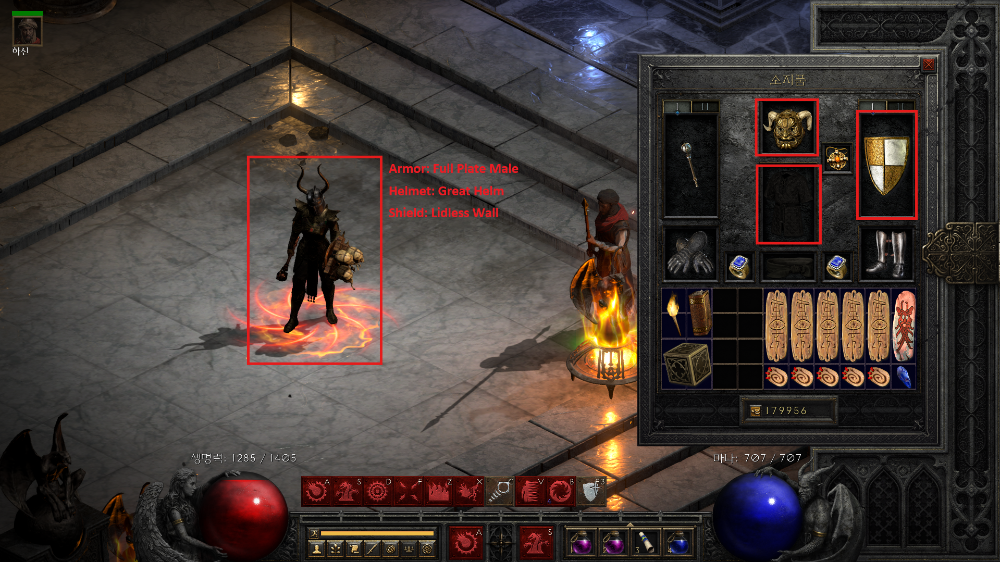

## Custom Armor Models

This feature enables players to customize the in-game appearance of their equipped armor without altering its stats or gameplay mechanics. By selecting from available models, you can make your character’s armor look exactly how you want, regardless of the item’s original visual design.

Note that, armor appearance may not be reflected in the character selection screen, but it will display correctly once you enter the game.

- Download Link
  - https://raw.githubusercontent.com/leewr9/diablo2r-mods/refs/heads/master/files/CustomArmorModels.zip
- Nexsus Mods
  - https://www.nexusmods.com/diablo2resurrected/mods/780
