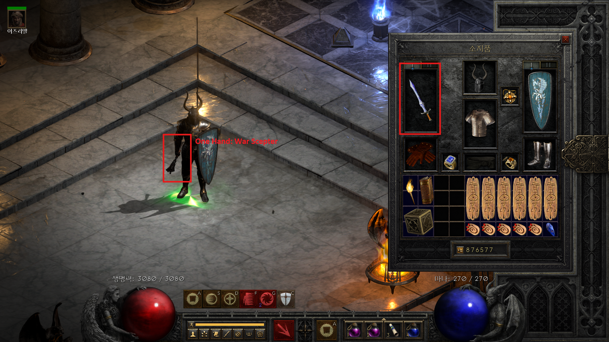
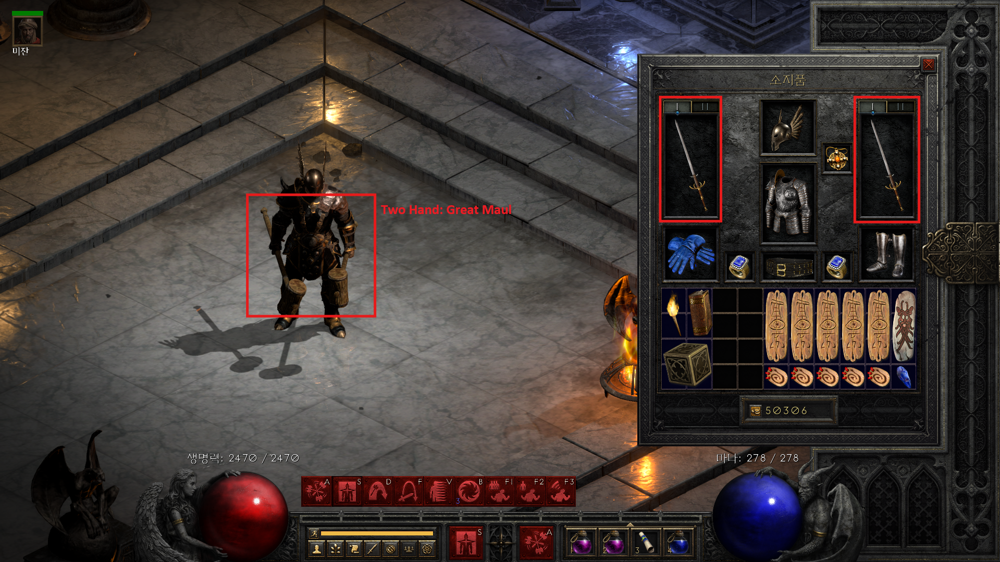
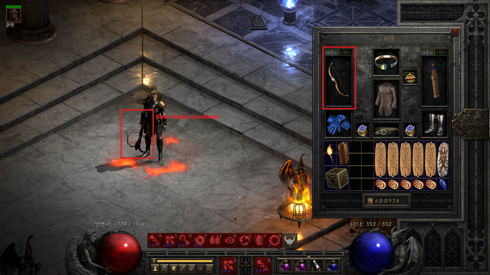

## Custom Weapon Models

This feature enables players to customize the in-game appearance of their equipped weapon without altering its stats or gameplay mechanics. By selecting from available models, you can make your character’s weapon look exactly how you want, regardless of the item’s original visual design.

- Download Link
  - https://raw.githubusercontent.com/leewr9/diablo2r-mods/refs/heads/master/files/CustomWeaponModels.zip
- Nexsus Mods
  - https://www.nexusmods.com/diablo2resurrected/mods/785
